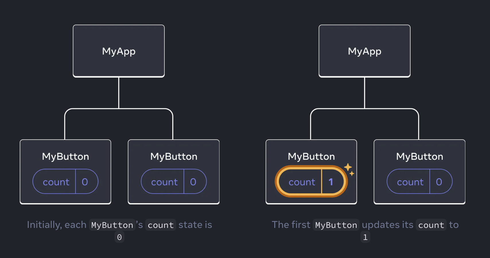
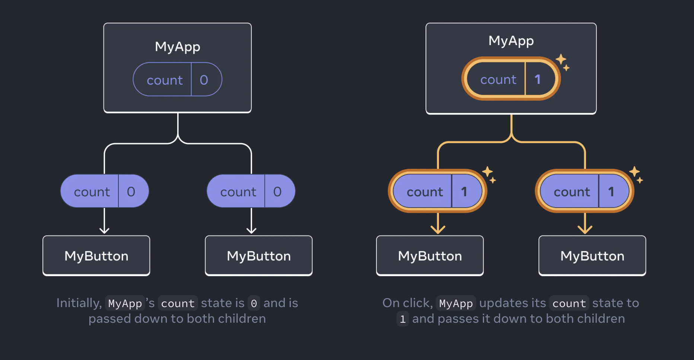

# Quick Start

Welcome to the React documentation! This page will give you an introduction to the 80% of React concepts that you will use on a daily basis.\
concepts [kɒnsept] n. 概念;\
basis ['beɪsɪs] n. 基础;

You will learn
- How to create and nest components
- How to add markup and styles
- How to display data
- How to render conditions and lists
- How to respond to events and update the screen
- How to share data between components

## Creating and nesting components
React apps are made out of components. A component is a piece of the UI(user interface) that has its own logic and appearance. A component can be as small as a button, or as large as an entire page.\
logic ['lɒdʒɪk] n. 逻辑;\
interface ['ɪntəfeɪs] n. 界面\
appearance [ə'pɪərəns] n. 外貌\
entire [ɪn'taɪə] adj. 整个的

React components are JavaScript functions that return markup:
```jsx
function MyButton() {
  return (
    <button>I'm a button</button>
  );
}
```
Now that you've declared `MyButton`, you can nest it into another component:
```jsx
export default function MyApp() {
  return (
    <div>
      <h1>Welcome to my app</h1>
      <MyButton />
    </div>
  );
}
```
declare [dɪ'kleə] v. 声明;\
Notice that `<MyButton />` starts with a capital letter. That's how you know it's a React component. React component names must start with a capital letter, while HTML tags must be lowercase.

Have a look at the result:
```jsx
function MyButton() {
  return (
    <button>
      I'm a button
    </button>
  );
}

export default function MyApp() {
  return (
    <div>
      <h1>Welcome to my app</h1>
      <MyButton />
    </div>
  );
}
```
The `export default` keywords specify the main component in the file. If you're not familiar with some piece of JavaScript syntax, `MDN` and `javascript.info` have great references.

## Writing markup with JSX

The markup syntax you've seen above is called `JSX`. It is optional, but most `React` projects use `JSX` for it's convenience. All of the tools we recommend for local development support `JSX` out of the box.\
optional ['ɒpʃən(ə)l] adj. 可选择的;\
convenience [kən'viːnɪəns] n. 便利\
recommend [rekə'mend] v. 推荐

`JSX` is stricter than `HTML`. You have to close tags like `<br />`. Your component also can't return multiple `JSX` tags. You have to wrap them into a shared parent, like a `<div>...<d/div>` or an empty `<>...</>` wrapper:\
stricter ['strɪktə] adj. 严格的;\
multiple ['mʌltɪp(ə)l] adj. 多个的;\
```jsx
function AboutPage() {
  return (
    <>
      <h1>About</h1>
      <p>Hello there.<br />How do you do?</p>
    </>
  );
}
```
Ig you have a lot of HTML to port to JSX, you can use an online converter.

## Adding styles

In React, you specify a CSS class with `className`.It works the same way as the HTML `class` attribute.
```jsx

```
Then you write the CSS rules for it in a separate CSS file:\
separate ['sep(ə)rət] adj. 分开的;\
```css
.avatar {
  border-radius: 50%;
}
```
React does not prescribe how you add CSS files. In the simplest case, you'll add a `<link>` tag to your HTML.If you use a build tool or a framework, consult it's documentation to learn how to add a CSS file to your project.\
prescribe [prɪ'skraɪb] v. 规定;\
consult [kən'sʌlt] v. 参考;

## Displaying data

JSX lets you put markup into JavaScript. Curly braces let you "escape back" into JavaScript so that you can embed some variable from your code and display it to the user.For example, this will display `user.name`:
curly braces ['kɜːli breɪsɪz] 大括号;\
escape [ɪ'skeɪp] v. 逃脱;\
embed [ɪm'bed] v. 嵌入;\
variable ['veərɪəbl] n. 变量;\
```jsx
return (
  <h1>
    {user.name}
  </h1>
);
```
You can also "escape into JavaScript" from JSX attributes, but you have to use curly braces instead of quotes. For example, `className="avatar"` passes the "avatar" string as the CSS class, but `src={user.imageUrl}` reads the JavaScript `user.imageUrl` variable value, and then passes that value as the `src` attribute:\
quotes [kwəʊts] n. 引号;\
avatar ['ævətɑː] n. 头像;
```jsx
return (
  
);
```
You can put more complex expressions inside the JSX curly braces too, for example, string concatenation:
complex [kəm'pleks] adj. 复杂的;\
concatenation [kənˌkætəˈneɪʃn] n. 连接;
```jsx
const user = {
  name: 'Hedy Lamarr',
  imageUrl: 'https://i.imgur.com/yXOvdOSs.jpg',
  imageSize: 90,
};

export default function Profile() {
  return (
    <>
      <h1>{user.name}</h1>
      
    </>
  );
}
```
In the above example, `style={{}}` is not a special syntax, but a regular `{}` object inside the `style={}` JSX curly braces. You can use the style attribute when your styles depend on JavaScript variables.\
regular ['reɡjʊlə] adj. 正规的;

## Conditional rendering
In React,there is no special syntax for writing conditions. Instead, you'll use the same techniques as you use when writing regular JavaScript code. For example, you can use an if statement to conditionally include JSX:
```jsx
let content;
if (isLoggedIn) {
  content = <AdminPanel />;
} else {
  content = <LoginForm />;
}
return (
  <div>
    {content}
  </div>
);
```
If you prefer more compact code, you can use the `conditional ? operator`. Unlike `if`. it works inside JSX:
```jsx
<div>
  {isLoggedIn ? (
    <AdminPanel />
  ) : (
    <LoginForm />
  )}
</div>
```
When you don't need the `else` branch, you can also use a shorter `logical && syntax`:
```jsx
<div>
  {isLoggedIn && <AdminPanel />}
</div>
```
All of these approaches also work for conditionally specifying attributes. If you're unfamiliar with some of this JavaScript syntax, you can start by always using `if...else`.\
approaches [ə'prəʊtʃɪz] n. 方法;

## Rendering lists

You will rely on JavaScript features like `for loop` and the `array map() function` to render lists of components.For example, let's say you have an array of products:
```jsx
const products = [
  { title: 'Cabbage', id: 1 },
  { title: 'Garlic', id: 2 },
  { title: 'Apple', id: 3 },
];
```
Inside your component, use the `map()` function to transform an array of products into an array of `<li>` items:
```jsx
const listItems = products.map(product =>
  <li key={product.id}>
    {product.title}
  </li>
);

return (
  <ul>{listItems}</ul>
);
```
Notice how `<li>` has a `key` attribute.For each item in a list,you should pass a string or a number that uniquely identifies that item among its siblings. Usually, a key should be coming from your data, such as a database ID.React uses your keys to know what happened if you later insert, delete, or reorder the items.\
uniquely ['juːniːkli] adv. 独特地;
```jsx
const products = [
  { title: 'Cabbage', isFruit: false, id: 1 },
  { title: 'Garlic', isFruit: false, id: 2 },
  { title: 'Apple', isFruit: true, id: 3 },
];

export default function ShoppingList() {
  const listItems = products.map(product =>
    <li
      key={product.id}
      style={{
        color: product.isFruit ? 'magenta' : 'darkgreen'
      }}
    >
      {product.title}
    </li>
  );

  return (
    <ul>{listItems}</ul>
  );
}
```

## Responding to events

You can respond to events by declaring event handler functions inside your components:
```jsx
function MyButton() {
  function handleClick() {
    alert('You clicked me!');
  }

  return (
    <button onClick={handleClick}>
      Click me
    </button>
  );
}
```
Notice how `onClick={handleClick}` has no parentheses at the end! Do not call the event handler function: you only need to pass it down. React will call your event handler when the user clicks the button.\
parentheses [pə'renθəsɪz] n. 圆括号;

## Updating the screen

Often, you'll want your component to "remember" some information and display it. For example, maybe you want to count the number of times a button is clicked. To do this, add state to your component.\
First, import `useState` from React:
```jsx
import { useState } from 'react';
```
Now you can declare a state variable inside your component:
```jsx
function MyButton() {
  const [count, setCount] = useState(0);
  // ...
```
You'll get two things from `useState`:the current state(count), and the function that lets you update it(setCount). You can give them any names, but the convention is to write [something, setSomething].

The first time the button is displayed, `count` will be `0` because you passed `0` to `useState()`. When you want to change state, call `setCount()` and pass the new value to it. Clicking this button will increment the counter:
```jsx
function MyButton() {
  const [count, setCount] = useState(0);

  function handleClick() {
    setCount(count + 1);
  }

  return (
    <button onClick={handleClick}>
      Clicked {count} times
    </button>
  );
}
```
React will call your component function again. This time, `count` will be `1`. Then it will be `2`. And so on.\
If you render the same component multiple times, each will get its own state. Click each button separately:
```jsx
import { useState } from 'react';

export default function MyApp() {
  return (
    <div>
      <h1>Counters that update separately</h1>
      <MyButton />
      <MyButton />
    </div>
  );
}

function MyButton() {
  const [count, setCount] = useState(0);

  function handleClick() {
    setCount(count + 1);
  }

  return (
    <button onClick={handleClick}>
      Clicked {count} times
    </button>
  );
}
```
Notice how each button "remembers" its own `count` state and doesn't affect other buttons.

## Using Hooks
Functions starting with `use` are called Hooks. `useState` is a built-in Hook provided by React. You can find other built-in Hooks in the `API reference`. You can also write your own Hooks by combining the existing ones.\
combining [kəm'baɪnɪŋ] v. 结合;\
exist ['ɪɡzɪst] v. 存在;

Hooks are more restrictive than other functions. You can only call Hooks at the top of your components(or other Hooks). If you want to use `useState` in a condition or a loop, extract a new component and put it there.\
restrictive [rɪ'strɪktɪv] adj. 限制性的;\
extract [ɪk'strækt] v. 提取;

## Sharing data between components

In the previous example, each `MyButton` had its own independent `count`, and when each button was clicked, only the `count` for the button clicked changed:\
previous ['priːvɪəs] adj. 以前的;



However, often you'll need components to share data and always update together.

To make both `MyButton` components display the same `count` and update together, you need to move the state from the individual buttons "upwards" to the closest component containing all of them.\
individual [ˌɪndɪ'vɪdʒʊəl] adj. 个别的;\
closest ['kləʊsɪst] adj. 最近的;

In this example, it is `MyApp`:



Now when you click either button, the `count` in `MyApp` will change both of the counts in `MyButton`. Here's how you can express this in code.

First, move the state up from `MyButton` into `MyApp`:
```jsx
export default function MyApp() {
  const [count, setCount] = useState(0);

  function handleClick() {
    setCount(count + 1);
  }

  return (
    <div>
      <h1>Counters that update separately</h1>
      <MyButton />
      <MyButton />
    </div>
  );
}

function MyButton() {
  // ... we're moving code from here ...
}
```
Then, pass the state down from `MyApp` to each `MyButton`, together with the shared click handler. You can pass information to `MyButton` using the JSX curly braces, just like you previously did with built-in tags like ``:
```jsx
export default function MyApp() {
  const [count, setCount] = useState(0);

  function handleClick() {
    setCount(count + 1);
  }

  return (
    <div>
      <h1>Counters that update together</h1>
      <MyButton count={count} onClick={handleClick} />
      <MyButton count={count} onClick={handleClick} />
    </div>
  );
}
```
The information you pass down like this is called props. Now the `MyApp` component contains the `count` state and the `handleClick` event handler, and passes both of them down as props to each of the buttons.

Finally, change `MyButton` to read the props you have passed from its parent component:
```jsx
function MyButton({ count, onClick }) {
  return (
    <button onClick={onClick}>
      Clicked {count} times
    </button>
  );
}
```
When you click the button, the `onClick` handler fires. Each button's `onClick` prop was set to the `handleClick` function inside `MyApp`, so the code inside of it runs. That code calls `setCount(count + 1)`, incrementing the `count` state variable. The new `count` value is passed as a prop to each button, so they all show the new value. This is called `lifting state up`. By moving state up, you've shared it between components.
```jsx
import { useState } from 'react';

export default function MyApp() {
  const [count, setCount] = useState(0);

  function handleClick() {
    setCount(count + 1);
  }

  return (
    <div>
      <h1>Counters that update together</h1>
      <MyButton count={count} onClick={handleClick} />
      <MyButton count={count} onClick={handleClick} />
    </div>
  );
}

function MyButton({ count, onClick }) {
  return (
    <button onClick={onClick}>
      Clicked {count} times
    </button>
  );
}
```

## Next Steps

By now, you know the basics of how to write React code!\
Check out the Tutorial to put them into practice and build your first mini-app with React.\
tutorial [tuːˈtɔːriəl] n. 教程;