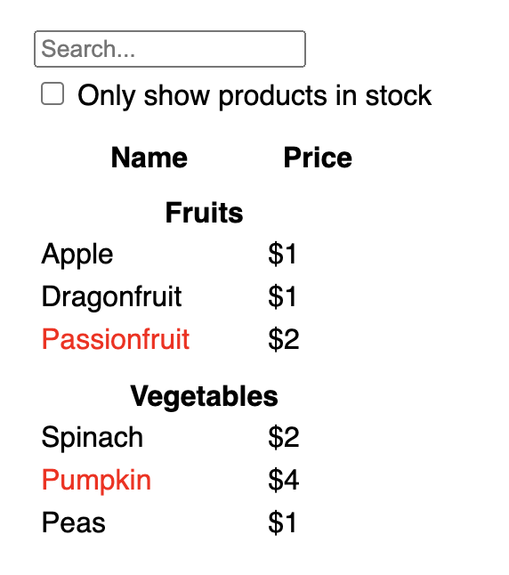
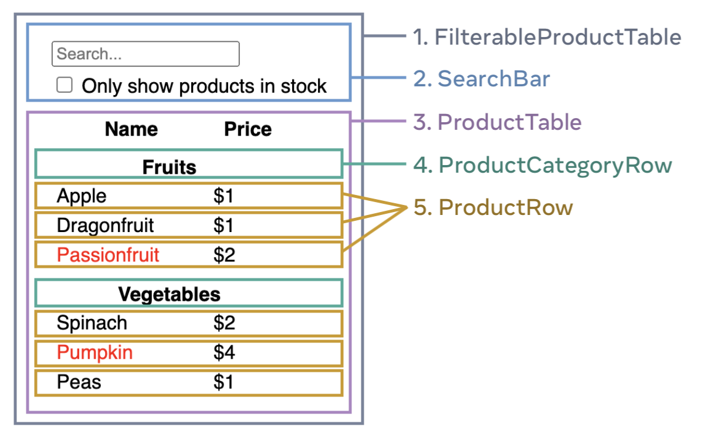

# Thinking in React

React can change how you think about the designs you look at and the apps you build. When you build a user interface with React, you will first break it apart into pieces called components. Then, you will describe the different visual states for each of your components. Finally, you will connect your components together so that the data flows through them. In this tutorial, we’ll guide you through the thought process of building a searchable product data table with React.\
apart [əˈpɑːrt] 分开

## Start with the mockup

Imagine that you already have a JSON API and a mockup from a designer.

The JSON API returns some data that looks like this:
```js
[
  { category: "Fruits", price: "$1", stocked: true, name: "Apple" },
  { category: "Fruits", price: "$1", stocked: true, name: "Dragonfruit" },
  { category: "Fruits", price: "$2", stocked: false, name: "Passionfruit" },
  { category: "Vegetables", price: "$2", stocked: true, name: "Spinach" },
  { category: "Vegetables", price: "$4", stocked: false, name: "Pumpkin" },
  { category: "Vegetables", price: "$1", stocked: true, name: "Peas" }
]
```
The mockup looks like this:


To implement a UI in React, you will usually follow the same five steps.\
implement [ˈɪmplɪment] 实施

## Step 1: Break the UI into a component hierarchy

Start by drawing boxes around every component and subComponent in the mockup and naming them. If you work with a designer, they may have already named these components in their design tool. Ask them!

Depending on your background, you can think about splitting up a design into components in different ways:

- **Programming**—use the same techniques for deciding if you should create a new function or object. One such technique is the single responsibility principle, that is, a component should ideally only do one thing. If it ends up growing, it should be decomposed into smaller subComponents.
- **CSS**—consider what you would make class selectors for. (However, components are a bit less granular.)
- **Design**—consider how you would organize the design’s layers.
principle [ˈprɪnsəpl] 原则\
ideal [aɪˈdiːəl] 理想的\
consider [kənˈsɪdər] 考虑\
granular [ˈɡrænjələr] 颗粒状的

If your JSON is well-structured, you’ll often find that it naturally maps to the component structure of your UI. That’s because UI and data models often have the same information architecture—that is, the same shape. Separate your UI into components, where each component matches one piece of your data model.\
structure [ˈstrʌktʃər] 结构\
architecture [ˈɑːrkɪtektʃər] 架构

There are five components on this screen:


1. `FilterableProductTable` (grey) contains the entire app.
2. `SearchBar` (blue) receives the user input.
3. `ProductTable` (lavender) displays and filters the list according to the user input.
4. `ProductCategoryRow` (green) displays a heading for each category.
5. `ProductRow` (yellow) displays a row for each product.

If you look at `ProductTable` (lavender), you’ll see that the table header (containing the “Name” and “Price” labels) isn’t its own component. This is a matter of preference, and you could go either way. For this example, it is a part of `ProductTable` because it appears inside the `ProductTable`’s list. However, if this header grows to be complex (e.g., if you add sorting), you can move it into its own `ProductTableHeader` component.\
lavender [ˈlævəndər] 紫色

Now that you’ve identified the components in the mockup, arrange them into a hierarchy. Components that appear within another component in the mockup should appear as a child in the hierarchy:\
hierarchy [ˈhaɪərɑːrki] 等级制度

- FilterableProductTable
    - SearchBar
    - ProductTable
        - ProductCategoryRow
        - ProductRow
